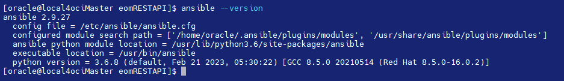

**Rest API for Oracle Enterprise Manager 13.5 RU 15**

This directory contains the files to setup a quick prototyping with REST API calls and Ansible to any OEM manager version 13.5RU14 and later.


How to setup the environment :

1. Check that your linux server is configured with ansible:
   

if ansible is not installed and you are using an Oracle Linux 8 follow the next steps:

```
dnf install -y epel-release
dnf install ansible -y
ansible --version
```

if ansible is not installed and your are using an Oracle Linux 7 follow the next steps:

```
rpm -Uvh epel-release-latest-7.noarch.rpm
yum install ansible
ansible --version
```

clone the git repository to your Linux server

open the file env_REST_APIS_OEM.sh and update all the variables to your own environment

```
mkdir -vp /home/oracle/eomRESTAPI
cd /home/oracle/eomRESTAPI
export OEM_user=YOUR_USER
export OEM_user_password=YOUR_PASSWORD
export OEM_URL=https://YOUR_OEM_IP:YOUR_OEM_PORT/em
```

Execute the following command which will generate all the Ansible playbooks to get the rest APIS :


```
source  env_REST_APIS_OEM.sh
source  generate_scripts.sh
```

